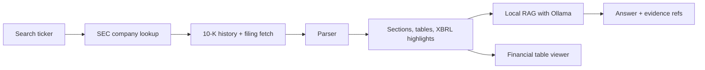

# SEC 10-K Research Dashboard

A full-stack research terminal for SEC 10-K filings. Search any public ticker, pull the company profile and filing history from EDGAR, inspect parsed filing sections and financial tables, review XBRL-derived highlights, and ask questions with a local Ollama model.

- Live ticker search and company lookup
- Full 10-K history, including archived filings
- Parsed filing sections for Business, Risk Factors, MD&A, Quantitative Disclosures, and Financial Statements
- Clean financial statement table viewing with short titles, expandable table browsing
- XBRL-based financial highlights for fast scanning
- Local filing Q&A with hybrid retrieval, reranking, and evidence citations
- Cross-checkable answer refs that jump back to the source evidence

## How it works



The backend fetches live SEC data, parses the filing, and returns a structured filing payload. The frontend renders that payload into the overview, filing history, financial statements, and local Q&A views.

## Quick Start

### Requirements

- Python 3.11+
- Node 18+
- Ollama for local LLM and embedding support

### Backend

```bash
cd backend
python -m venv .venv
source .venv/bin/activate
pip install -r requirements.txt
uvicorn app:app --reload --port 8000
```

The API runs at [http://127.0.0.1:8000](http://127.0.0.1:8000) and FastAPI docs are available at [http://127.0.0.1:8000/docs](http://127.0.0.1:8000/docs).

### Frontend

```bash
cd frontend
npm install
npm run dev
```

The app runs at [http://127.0.0.1:5173](http://127.0.0.1:5173).

### Optional local LLM

```bash
ollama pull llama3.2
ollama pull nomic-embed-text
ollama serve
```

The app uses `llama3.2` by default for answers and `nomic-embed-text` for dense retrieval. If Ollama is not available, the Q&A panel falls back to local retrieval so the rest of the app still works.

## Using the app

1. Search any ticker such as `AAPL`, `MSFT`, or `NVDA`.
2. Open the company overview and check the filing history.
3. Select a 10-K to load the filing analysis.
4. Review the financial highlights and the extracted financial tables.
5. Use the Local Filing Q&A panel to ask questions about the filing.
6. Click the evidence chips to jump back to the supporting lines or table.

The financial table viewer keeps the three core statements easy to reach:

- Income Statement
- Balance Sheet
- Cash Flow Statement

## API

| Method | Path | What it does |
| --- | --- | --- |
| GET | `/api/search/{ticker}` | Resolve a ticker to SEC company data and 10-K history |
| GET | `/api/filing/{cik}/{accession_number}` | Fetch and parse a specific 10-K |
| GET | `/api/financials/{cik}` | Return XBRL-derived financial highlights |
| GET | `/api/autocomplete?q={query}` | Suggest tickers and company names |
| POST | `/api/ask` | Ask the local filing-aware RAG system a question |

## Project Layout

```text
sec-dashboard/
├── backend/
│   ├── app.py
│   ├── sec_client.py
│   ├── parser.py
│   ├── rag.py
│   ├── models.py
│   └── routes/
│       └── filings.py
├── frontend/
│   └── src/
│       ├── App.tsx
│       ├── components/
│       │   ├── FinancialTables.tsx
│       │   ├── LocalQueryPanel.tsx
│       │   ├── SectionReader.tsx
│       │   └── ...
│       └── services/
│           └── api.ts
└── docs/
    ├── TECHNICAL_GUIDE.md
    └── RAG_ARCHITECTURE.md
```

## Configuration

- `LOCAL_LLM_MODEL` controls the default answer model used by the backend.
- `LOCAL_EMBED_MODEL` controls the embedding model used for dense retrieval.
- `backend/sec_client.py` contains the SEC `User-Agent` string. Replace the placeholder with your own contact information for deployment.

## Troubleshooting

- If ticker search returns nothing, check the symbol spelling or try another ticker.
- If the Q&A panel says it is falling back, make sure `ollama serve` is running and the model is pulled.
- If the financial tables look stale after code changes, restart the backend and refresh the browser.
- If a filing appears missing, the app may still be loading an archived EDGAR submission file in the background.

